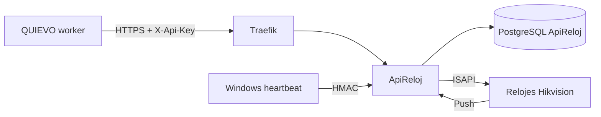
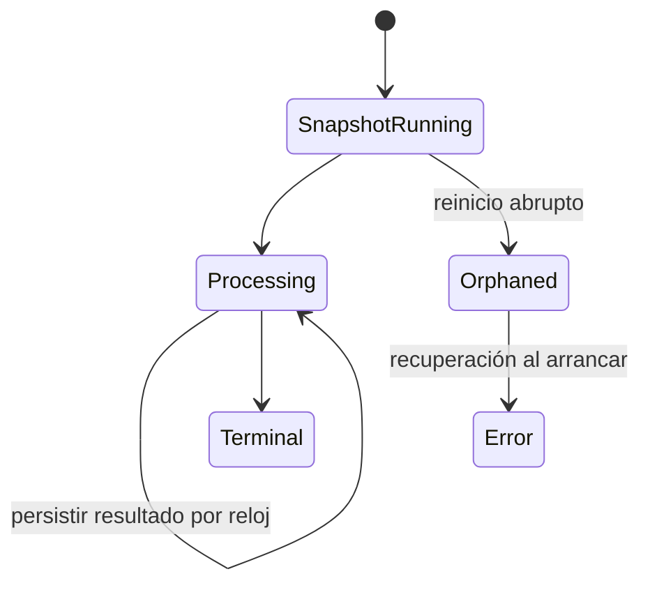
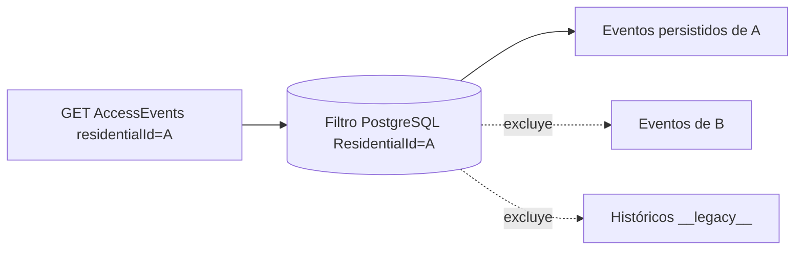

# Compatibilidad entre ApiReloj y QUIEVO

Contrato revisado el 1 de septiembre de 2026 contra QUIEVO `de6b2bea`.

## Arquitectura y dirección de llamadas

QUIEVO no llama a ISAPI y ApiReloj no llama de vuelta a QUIEVO. No existe variable de callback del backend.

## Matriz contractual

| Área | Contrato final | Impacto en QUIEVO |
|---|---|---|
| Autenticación | `X-Api-Key` y origen igual a `Security:Backend:AllowedIp`. | Sin cambio de schema. |
| Proxy | ApiReloj procesa XFF/XFP solo desde Traefik configurado. | QUIEVO continúa usando la URL HTTPS normal. |
| Device | `_secretKey` es write-only. | Mantener schema de respuesta estricto sin secret. |
| AccessEvents | `_residentialId` se persiste en ingesta y se filtra directamente en PostgreSQL. | Se elimina mezcla o pérdida causada por relojes actuales. |
| Jornadas | Proyección durable, revisiones, tombstones y códigos vigentes. | Sin cambios adicionales. |
| Poll running | `finishedAtUtc=null`, snapshot completo y estados `pending/ok/skipped/error`. | Compatible con la unión discriminada del backend. |
| Poll terminal | Fecha obligatoria y ningún reloj `pending`; fallo parcial y total se distinguen. | Compatible sin relajar schemas. |
| Trigger Poll | Solo `manual` o `scheduled`. | Coincide con `pollTriggerSchema`. |
| Errores | 404 inexistente, 409 duplicado, 401/403 seguridad. | Mejora la categorización y reconciliación. |

## Recuperación de Poll

Antes de contactar ISAPI, ApiReloj persiste el conjunto inmutable de relojes solicitado:

Un timeout de QUIEVO puede reconciliarse mediante `GET /admin/poll/status` y `GET /admin/poll/runs/{runId}`. Un reinicio de ApiReloj cierra los runs huérfanos como `error`; no los deja indefinidamente en `running`.

## Datos históricos

Las filas anteriores a la incorporación de `ResidentialId` no ofrecen evidencia suficiente para reconstruir tenant usando el reloj actual. Se conservan con `ResidentialId=__legacy__` y no aparecen al consultar un residencial real. Una reasignación posterior requiere un proceso de saneamiento explícito y auditado.

## Cambios que no se hicieron

- No se modificó el backend QUIEVO.
- No se relajaron validadores Zod.
- No se expusieron secretos.
- No se movió ISAPI al backend.
- No se agregaron webhooks ni callbacks.
- No se cambió la identidad idempotente `DeviceSn + SerialNumber`.

## Restricción operativa

ApiReloj debe desplegarse con una réplica. Escalar horizontalmente requiere reemplazar el semáforo por un lease o lock distribuido PostgreSQL antes de aumentar réplicas.
