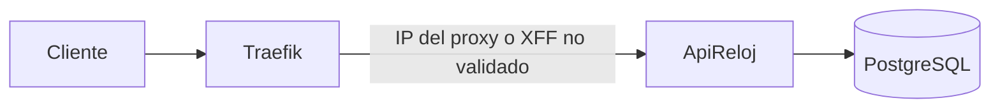
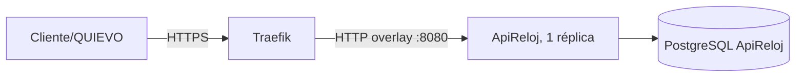
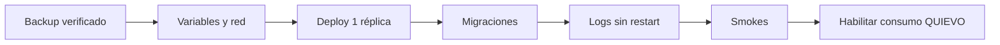
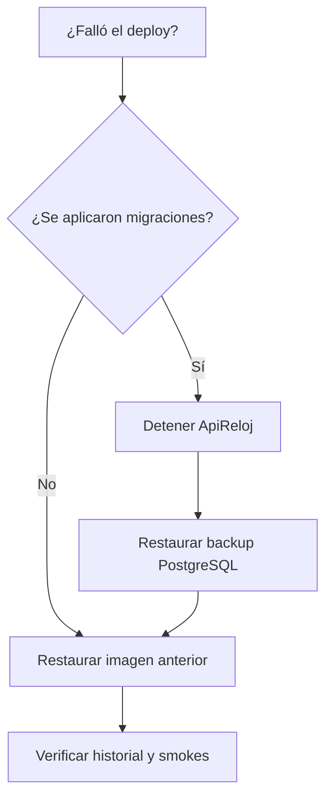

# Despliegue en Dokploy detrás de Traefik

Runbook vigente al 1 de septiembre de 2026.

## Topología

Antes del hardening, la aplicación podía observar la IP de Traefik o depender de headers reenviados sin expresar una frontera de confianza:



Después de la integración:



Traefik termina TLS. ApiReloj confía X-Forwarded-For y X-Forwarded-Proto únicamente cuando la conexión inmediata proviene de la IP o red configurada.

## Variables obligatorias

```dotenv
ASPNETCORE_ENVIRONMENT=Production
ASPNETCORE_URLS=http://+:8080
ConnectionStrings__Default=Host=<database>;Port=5432;Database=apireloj;Username=apireloj;Password=<secret>

Security__Backend__ApiKey=<clave-larga-aleatoria>
Security__Backend__AllowedIp=<ip-observable-de-quievo>

Security__Proxy__Enabled=true
Security__Proxy__ForwardLimit=1
Security__Proxy__KnownNetworks__0=<cidr-overlay-traefik>

ISAPI_USER=<usuario-isapi>
ISAPI_PASSWORD=<password-isapi>
BackfillPolling__RunOnStartup=false
```

En la aplicación directa de Dokploy deben usarse los nombres ASP.NET completos. Los aliases `BACKEND_API_KEY`, `DB_NAME` y similares solo funcionan cuando `docker-compose.yml` realiza el mapeo.

No configurar `ASPNETCORE_FORWARDEDHEADERS_ENABLED=true`; la confianza debe permanecer limitada a Traefik.

## Descubrir la red confiable

En el host Docker:

```bash
docker network ls
docker network inspect <red-traefik>
```

Usar el valor `IPAM.Config[].Subnet`, no la IP efímera de un contenedor. Tras configurarlo, una petición proveniente de otra red no puede falsificar X-Forwarded-For.

## Gate de migraciones

Antes del primer despliegue:

```sql
SELECT "MigrationId"
FROM "__EFMigrationsHistory"
ORDER BY "MigrationId";

SELECT "Status", "Trigger", COUNT(*)
FROM "BackfillPollRuns"
GROUP BY "Status", "Trigger";
```

Si `20260714210010_JornadaProjectionQueue` ya figura aplicada en una BD productiva no auditada, detenerse. No aplicar el despliegue hasta determinar cómo fueron asignados los históricos.

Tomar y verificar un backup antes de iniciar. ApiReloj ejecuta `Database.MigrateAsync()` antes de escuchar HTTP; si la BD o una migración falla, el contenedor debe fallar en vez de servir con un schema parcial.

## Orden de despliegue



1. Deshabilitar `RunOnStartup` para evitar ISAPI durante el smoke inicial.
2. Desplegar exactamente una réplica.
3. Verificar logs de migración, `Now listening on ...:8080` y ausencia de restart loop.
4. Confirmar que no queden runs huérfanos:

   ```sql
   SELECT "RunId", "StartedAtUtc"
   FROM "BackfillPollRuns"
   WHERE "Status" = 'running';
   ```

5. Ejecutar pruebas por el dominio público:

   ```bash
   curl -i https://<dominio>/Residential
   curl -i -H 'X-Api-Key: incorrecta' https://<dominio>/Residential
   curl -i -H 'X-Api-Key: <correcta>' https://<dominio>/Residential
   ```

   Los resultados esperados son 401, 401 y 200 desde la IP autorizada; una key válida desde otra IP recibe 403.
6. Verificar heartbeat, push, aislamiento de AccessEvents, jornadas y Poll con entidades de prueba.

## Rollback

Si la imagen nueva falla antes de aplicar migraciones, puede restaurarse la imagen anterior. Si alguna migración nueva ya quedó aplicada, restaurar de forma coordinada:

1. Detener ApiReloj.
2. Restaurar el backup PostgreSQL anterior.
3. Desplegar la imagen anterior.
4. Verificar historial de migraciones y smokes.

Volver solamente a la imagen anterior no es seguro: esa versión no escribe las columnas obligatorias incorporadas por `repo-readiness`.



## Diagnóstico

- 401: API key ausente o incorrecta.
- 403: `AllowedIp` no coincide con la IP obtenida tras forwarded headers.
- Redirect HTTP/HTTPS: revisar X-Forwarded-Proto y red confiable.
- Todos los clientes comparten rate limit: forwarded headers no se están aplicando.
- `libgssapi_krb5.so.2` ausente: advertencia de autenticación integrada; no es fallo si Npgsql conecta y la aplicación queda escuchando.
- Run Poll `error` inmediatamente después de reiniciar: recuperación esperada de una ejecución interrumpida.
