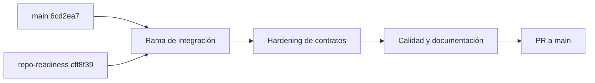

# Integración de `main` y `codex/repo-readiness`

Fecha: 1 de septiembre de 2026.

## Propósito

La rama `main` contenía los últimos arreglos de despliegue y la corrección PostgreSQL de IDs string. La rama `codex/repo-readiness` contenía el contrato funcional más completo: seguridad, ingesta autenticada, proyección durable de jornadas, heartbeat, Poll administrativo, CI y documentación contractual.

La integración se realizó en `codex/integrate-repo-readiness-dokploy` para validar ambas líneas antes de modificar `main`.

## Baselines usados

| Fuente | Commit | Contenido relevante |
|---|---|---|
| ApiReloj `main` | `6cd2ea7` | Deploy y migración de IDs corregida. |
| ApiReloj `repo-readiness` | `cff8f39` | Funcionalidad de `8a641ed` y documentación binaria Hikvision. |
| QUIEVO backend | `de6b2bea` | Schemas y recuperación usados como contrato consumidor. |

El commit `cff8f39` agrega diez archivos binarios Hikvision. Su inclusión fue deliberada; no se descartó ese commit durante el merge.

El merge quedó aislado en `ae65c99`. El hardening posterior se separó en `1186850` (proxy), `9cffbbd` (AccessEvents), `f4f377b` (Poll) y `bfd62b3` (semántica HTTP), más el commit final de regresión, CI y documentación.

Los diez binarios son el ZIP original, siete PDF y dos XLSX del paquete Hikvision. El mayor mide 66.251.801 bytes, por debajo del límite individual de 100 MB de GitHub. No se detectaron nombres ni contenido de configuración que representaran credenciales del proyecto.

## Conflictos resueltos

1. `20260429005313_MaestrosIdsString.cs`: se conservó el SQL explícito de `main`, incluyendo `USING ...::text`, porque `AlterColumn<int,string>` no convierte de forma segura una BD PostgreSQL existente.
2. `Program.cs`: se conservaron seguridad, workers y proyección durable de `repo-readiness`, junto con la aplicación automática y asíncrona de migraciones antes de abrir la API.
3. `.gitignore`: Git pudo combinar las reglas; se mantuvo la exclusión de artefactos .NET, resultados de test, `.env` y secretos.

Los archivos locales `PruebaFinalesAMano.md` y `docker-compose.local.yml` no formaron parte del merge ni de los commits.

## Hardening posterior

- Forwarded headers confiando solamente en proxy o red configurada.
- Filtro PostgreSQL autoritativo por `AccessEvents.ResidentialId`.
- Cuarentena `__legacy__` para históricos sin ownership demostrable.
- Snapshot durable de Poll antes de ISAPI, progreso por reloj y recuperación tras reinicio.
- Triggers de Poll limitados a `manual` y `scheduled`.
- 404 para entidades inexistentes y 409 para duplicados.
- Smoke multi-tenant y pruebas de contrato adicionales.

## Decisiones arquitectónicas

- ApiReloj sigue siendo dueño de ISAPI, push, heartbeat, eventos, Poll y jornadas.
- QUIEVO consume ApiReloj; ApiReloj no conoce una URL de callback del backend.
- Los schemas estrictos de QUIEVO no se relajaron.
- La operación actual admite exactamente una réplica de ApiReloj. El semáforo de Poll es por proceso y la recuperación de runs ocurre al arrancar esa única réplica.
- No se atribuye historia por la relación actual de un reloj. Los datos sin evidencia permanecen en cuarentena.

## Rollback

Las migraciones incorporan columnas obligatorias desconocidas por la versión anterior. Por eso, después de migrar, un rollback completo requiere restaurar tanto la imagen anterior como el backup de PostgreSQL tomado antes del despliegue.

## Validaciones previas al PR

- Restore con NuGet audit y reporte de vulnerabilidades: sin hallazgos.
- Build Release: cero warnings y cero errores.
- Suite ApiReloj: 46/46 pruebas, incluidas cuatro integraciones PostgreSQL.
- Migraciones: aplicación completa en BD vacía y actualización desde abril con datos sembrados.
- Resultado del upgrade: históricos en `__legacy__`, trigger `startup` normalizado e índice tenant presente.
- Modelo EF: sin cambios pendientes; script idempotente generado y revisado.
- Docker: imagen de producción construida.
- Smoke HTTP: autenticación, heartbeat, replay, push, dedupe, multi-tenant y jornada cross-clock.
- QUIEVO `de6b2bea`: 270 pruebas pasaron y tres live quedaron omitidas por diseño.

La consulta al historial y el backup de la base desplegada, además del staging Dokploy, siguen siendo gates operativos externos y deben completarse antes de producción.
